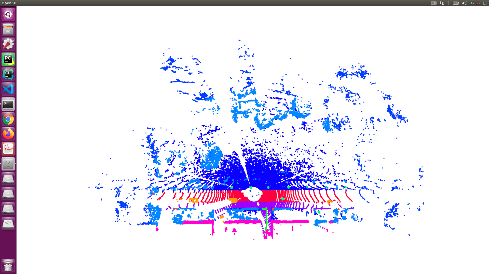
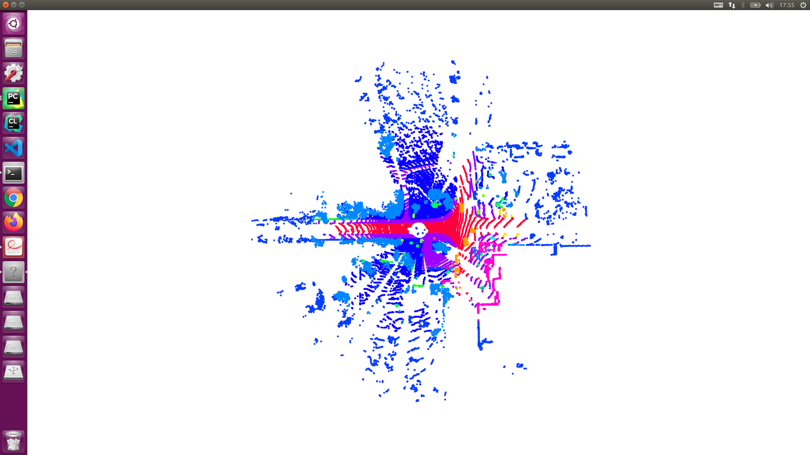

# Visualize for 3d points

This code has been tested with Python 3.5. Based on RandLA-Net for `.ply(x, y, z, val, gt)` visualization.

- Setup python environment
```
pip install -r requirements.txt
```
- results

|     |    |
| -------------------------------- | ------------------------------- |